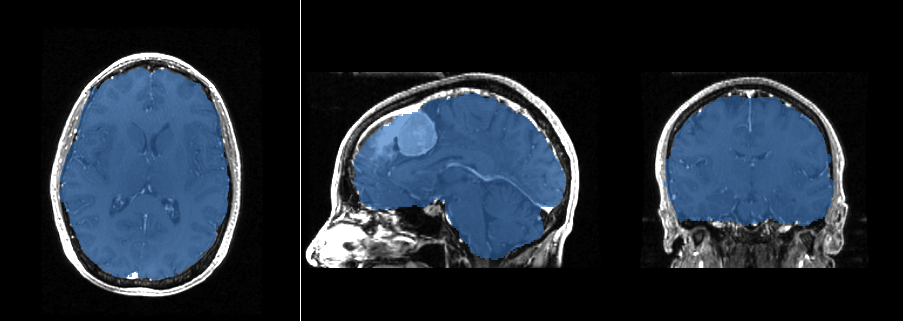
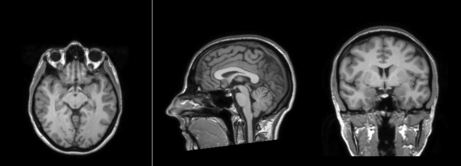
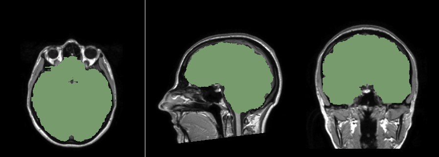
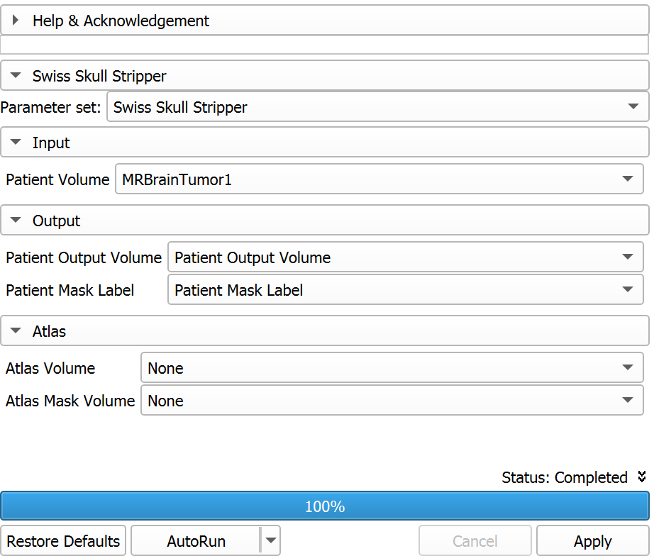

# SwissSkullStripper

This is an extension for [3D Slicer](https://www.slicer.org) for skull stripping (i.e., removing all image content outside the brain) in MRI images.

The algorithm registers a grayscale atlas image to the grayscale patient data. The associated atlas brain mask is propagated to the patient data using the registration transformation. This brain mask is eroded and serves as initialization for a refined brain extraction based on level-sets. The level-set towards the edge of the brain-skull border with dedicated expansion, curvature and advection terms. The algorithm produces a brain mask for the patient data as well as the patient data with the mask applied.

The extension comes with an isotropic T1-weighted MR image (atlas) and a corresponding manually generated brain label image (mask). This image pair is used by default, but users can also provide their own atlas and mask images.

## Tutorial

### Basic workflow

- [Install 3D Slicer](https://slicer.readthedocs.io/en/latest/user_guide/getting_started.html#installing-3d-slicer) and [install SwissSkullStripper extension](https://slicer.readthedocs.io/en/latest/user_guide/extensions_manager.html#install-extensions)
- Load a patient volume. You can use `MRBrainTumor1` data set provided by `Sample Data` module.
- Go to `Swiss Skull Stripper` module
- Select the `Patient volume` (e.g., ''MRBrainTumor1'')
- Create new volumes for `Patient output volume` and `Patient mask label`
- Click Apply. Within about 2 minutes, the module produces:
  - A patient volume that resides within the patient mask
  - A patient brain mask volume
- For better visualization of the patient mask volume, make it displayed as outline only: go to `Data` module, right-click on the "eye" icon of patient mask label volume, and check `Toggle 2D outline visibility`

### Use custom atlas and brain mask images

For better accuracy, choose an atlas image (and corresponding brain mask image) that is similar to the patient image. Any brain MRI image can be used as atlas image, and a corresponding brain mask image can be created using the Segment Editor module.

The default [atlas image](https://github.com/lassoan/SlicerSwissSkullStripper/raw/master/SwissSkullStripper/Data/Input/atlasImage.mha) and [brain mask image](https://github.com/lorensen/SwissSkullStripperExtension/raw/master/SwissSkullStripper/Data/Input/atlasMask.mha) can be used as examples.

Default atlas image:

Default brain mask:

To use custom atlas image and brain mask volumes:
- Load the atlas image
- Load the brain mask image. Only labelmap volumes will show up in the atlas mask volume selector.
  - If the mask was loaded as a segmentation then right-click in `Data` module and choose `Export visible segments to binary labelmap` to convert it to a labelmap volume.
  - If the mask was loaded as a scalar volume then [load the mask image again, as a labelmap volume](https://slicer.readthedocs.io/en/latest/user_guide/modules/volumes.html#load-image-file-as-labelmap-volume).

## Panels and their use

- **Input**
  - **Patient volume**: brain region will be extracted from this volume
- **Output**
  - **Patient output volume**: computed image that contains the patient image with region outside the brain blanked out
  - **Patient mask label**: computed labelmap image that contains non-zero voxel inside the brain region and zero voxels outside
- **Atlas**: optional manually specified atlas and mask, if left at `None` then the default atlas and mask are used
  - **Atlas volume**: brain MRI image
  - **Atlas mask volume**: labelmap image containing non-zero voxels inside the brain and voxels with 0 value outside the brain

## Related modules

[HDBrainExtraction extension](https://github.com/lassoan/SlicerHDBrainExtraction#hdbrainextraction) is a higher-quality, more robust skull stripping tool. It uses a neural network, therefore its computational requirements are much higher. Using a strong GPU, then computation is completed in about 20 seconds. If computation is done on CPU then it may take 5-10 minutes.

## References

Bauer S., Fejes T., Reyes M., "A Skull-Stripping Filter for ITK", [Insight Journal, January-December, 2012](http://hdl.handle.net/10380/3353).

## Acknowledgments

This work is based the Skull-Stripper Filter for ITK, Stefan Bauer, Thomas Fejes and Mauricio Reyes, Institute for Surgical Technology and Biomechanics, University of Bern, Switzerland

Contributors:
- Bill Lorensen
- Stefan Bauer (Institute for Surgical Technology and Biomechanics, University of Bern)
- Thomas Fejes (Institute for Surgical Technology and Biomechanics, University of Bern)
- Mauricio Reyes (University of Bern)
- Arnaud Gelas (Crisalix)
- Andras Lasso (PerkLab)

A version of the module that can be used outside Slicer4 as an ITK remote module is located at <http://github.com/lorensen/skullStrip>.

This repository is the continuation of the [repository that Bill Lorensen developed and maintained](https://github.com/lorensen/SwissSkullStripperExtension) until he [passed away in 2019](https://www.computer.org/csdl/magazine/cg/2020/02/09020249/1hS2S5b2V6E?msclkid=a0c53526c3fd11ecb975bf92e6af2a8c).
